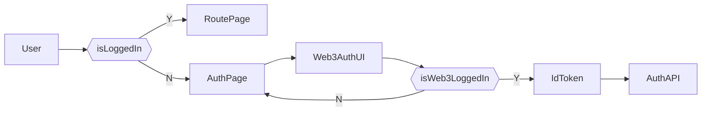
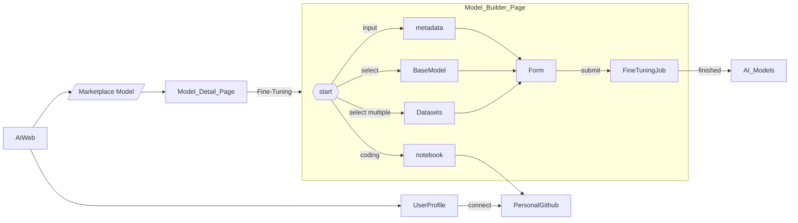
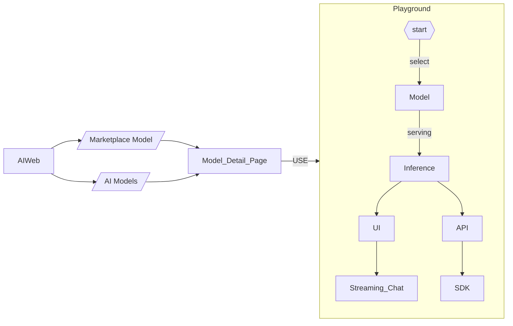
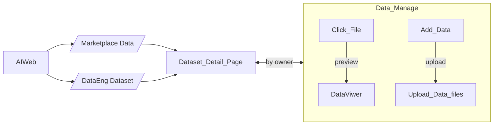

## Marketplace

### Model

Marketplace models

- Platform Base Models

  - meta-llama/Meta-Llama-3-8B from hugging face [link](https://platform.openai.com/playground/chat?models=gpt-4-turbo)
  - Claude 3 Opus (anthropic.claude-3-opus-20240229-v1:0) from AWS bedrock (see picture below)
  - gpt-4-turbo from OpenAI (link)
  - rest of models just pick some popular image, audio, video ones from HuggingFace

- User Public Models

### Data

Marketplace datasets

## Ai

### Playground

Public model inference Playground

### Notebooks

my notebooks

### Models

my models

### Serving

my deployed/running model to server

### Fune tuning Jobs

my fune tuning job

## Data Engineering

### Datasets

### Data integration

- data upload
- database connections
- zettablock query builder

### ZRunner

### Data Jobs

## User Flow

### Model Builder

-User SignIn & SignUp Flow

- Fine-tuning Model Flow

AI Playground Flow

Coding Notebook Flow

Data Prepare Flow

